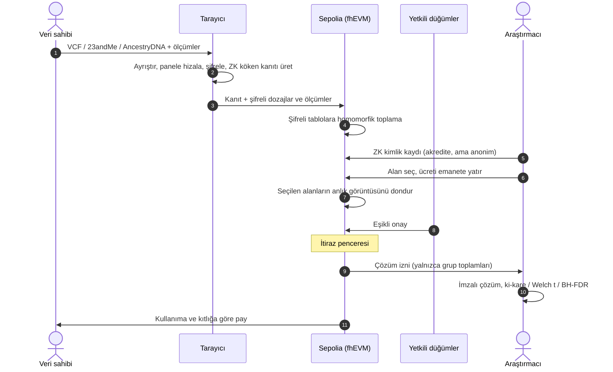

<div align="center">

# VeriArfy

**Şifreli genomik veri pazarı**

Veri sahibi verisini kendi cihazında şifreler. Araştırmacı yalnızca ihtiyaç duyduğu
alanları satın alır. Hiçbir noktada bireysel kayıt açılmaz.

[Canlı demo](https://veri-arfy.vercel.app) ·
[Mimari kararlar](docs/mimari/) ·
[Operasyon kılavuzu](docs/OPERASYON.md)


</div>

---

## İçindekiler

- [Sorun](#sorun)
- [Çözüm](#çözüm)
- [Nasıl çalışır](#nasıl-çalışır)
- [Ödeme modeli](#ödeme-modeli)
- [Mimari](#mimari)
- [Hızlı başlangıç](#hızlı-başlangıç)
- [Yapılandırma](#yapılandırma)
- [Test](#test)
- [Dağıtım](#dağıtım)
- [Güvenlik modeli ve sınırlar](#güvenlik-modeli-ve-sınırlar)
- [Belgeler](#belgeler)
- [Lisans](#lisans)

---

## Sorun

Bir GWAS çalışması binlerce katılımcının genotipine ihtiyaç duyar. Bu kohortu
toplamak çalışmanın en pahalı ve en yavaş kısmıdır. Aynı veri bir kez satılır,
defalarca kullanılır ve verinin geldiği kişiye hiçbir şey dönmez.

Veriyi paylaşmak mahremiyetten vazgeçmek anlamına geldiği sürece, paylaşmak
isteyen kişinin makul bir seçeneği yoktur.

## Çözüm

VeriArfy iki tarafı, veriyi hiç açmadan buluşturur:

- **Veri tarayıcıdan çıkmaz.** Dosya yerelde ayrıştırılır ve şifrelenir; zincire
  yalnızca şifreli değerler gider.
- **Hesap şifreliyken yapılır.** Kontenjans tabloları ve istatistiksel toplamlar
  zincirde homomorfik olarak birikir.
- **Araştırmacı grup istatistiği alır.** Vaka ve kontrol gruplarının toplamları
  döner; bireysel kayıt asla dönmez.
- **Ödeme kullanıma ve nadirliğe göredir.** Veri sahibi, verisi kullanılan her
  alan için pay alır; az bulunan veri daha çok kazandırır.

Sistem üç ayrı soruyu üç ayrı katmanla çözer:

| Katman | Soru | Çözüm |
|---|---|---|
| **FHE** | Veri açılmadan nasıl hesaplanır? | Zama fhEVM üzerinde şifreli kontenjans tabloları ve Welch yeterli istatistikleri (`n`, `Σx`, `Σx²`) |
| **ZK** | Bir iddia, kimlik açılmadan nasıl kanıtlanır? | Kapsama bitleri devrede taahhütten türetilir; araştırmacı akreditasyonu Merkle üyeliğiyle kanıtlanır |
| **Erişim** | Sonuca kim, ne zaman erişebilir? | Teminatlı düğümlerin eşikli onayı, itiraz penceresi, ardından yalnızca araştırmacıya çözüm izni |

---

## Nasıl çalışır



### Veri sahibi

1. **Gruba kayıt.** Vaka ya da kontrol etiketi şifreli olarak bir kez yazılır;
   zincir hangisinin seçildiğini göremez.
2. **Genomik dosya.** VCF, 23andMe veya AncestryDNA ham dosyası tarayıcıda
   ayrıştırılır. Kullanıcıya dosyasında hangi varyantların olduğu sorulmaz;
   sistem bunu kendisi çıkarır.
3. **Panele hizalama.** Dozajlar, çalışmanın zincirde özeti ilan edilmiş
   paneline göre sıralanır. Eksik veri `3` olarak işaretlenir; bilinmeyene `0`
   yazmak, "homozigot referans" demek olurdu.
4. **ZK köken kanıtı.** Tarayıcıda üretilen Groth16 kanıtı, kapsama bitlerinin
   taahhüde giren dozajlardan türediğini gösterir. Kanıt, zincire girecek şifreli
   metinlerin özetine bağlıdır.
5. **Şifreli gönderim.** Dozajlar `euint8`, ölçümler `euint32` olarak partiler
   halinde gönderilir ve şifreli tablolara eklenir.
6. **Kazanç.** Payını takip eder ve çeker. İstediği zaman havuzdan ayrılabilir.

### Araştırmacı

1. **ZK kimlik kaydı.** Akredite araştırmacı ağacında bulunduğunu kanıtlar.
   Defter, araştırmacının akredite olduğunu bilir ama hangi kimlik olduğunu bilmez.
2. **Alan seçimi.** Her alanın yanında kaç kişinin veri verdiği ve kıtlık çarpanı
   görünür; fiyat seçimle birlikte anlık güncellenir.
3. **Emanet.** Ücret emanete alınır. Ödeme tek başına hiçbir şeyi çözmez.
4. **Onay ve itiraz.** Teminatlı bağımsız düğümler eşikli onay verir, ardından
   itiraz penceresi açılır. Onay hiç gelmezse ücret iade edilebilir.
5. **Sonuç.** Çözüm izni yalnızca araştırmacının adresine verilir. Dönen şey bir
   grup istatistiğidir:

| Veri türü | Zincirde biriken | Analiz |
|---|---|---|
| Genomik (kategorik 0/1/2) | SNP başına 2×3 kontenjans tablosu | Ki-kare, BH-FDR, odds oranı ve %95 GA, Fisher, HWE |
| Biyobelirteç (sürekli) | Grup başına `n`, `Σx`, `Σx²` | Welch t, Cohen d |

İstatistiksel testler bölme gerektirdiği için zincirde değil, tarayıcıda ve
yalnızca çözülmüş grup toplamları üzerinde yapılır.

---

## Ödeme modeli

Ücret **kayıt başınadır**: bir kayıt = bir kişi × bir alan.

```
ücret        = taban + Σ  kayıt(alan) × kayıtFiyatı × kıtlık(alan)
                     alan ∈ istenen

kıtlık(alan) = havuz / o alanı verenler          [1x … 10x]
```

Araştırmacı iki alan isterse ve bu alanlara 40 ve 12 kişi veri vermişse, satın
aldığı şey **52 kayıttır**, havuzun tamamı değil. İstenen alanda verisi olmayan
kişi için ödeme yapılmaz.

Aynı kıtlık çarpanı hem fiyatı hem veri sahibinin payını belirler:

```
pay(kişi) = kullanımPayı ×   Σ kıtlık(alan)       /   Σ kayıt(alan) × kıtlık(alan)
                          kişinin verdiği alanlar      istenen alanlar
```

Payda, ücretin alan bileşeniyle birebir aynı formüldür; ödenen ile hak edilen
tek bir sayıdan türer. Çarpan zincirdeki kapsama sayaçlarından türetilir, kimse
elle değer atamaz.

| Dağılım | Oran |
|---|---|
| Katılımcı havuzu | %80 (sözleşmede değiştirilemez) |
| ↳ kullanım payı | havuzun %70'i |
| ↳ nadirlik ve kurucu katkıcı bonusu | havuzun %30'u |
| Hazine | %20 |

Varsayılan fiyatlar: taban 1 USDC, kayıt başına 0,05 USDC. Ödeme birimi Circle'ın
Sepolia test USDC'sidir; mainnet'e geçişte yalnızca token adresi değişir.

---

## Mimari

```
packages/
├── web/               React + Vite arayüzü (Vercel'de statik)
├── contracts/         fhEVM sözleşmeleri (Solidity, Hardhat)
├── circuits/          circom devreleri ve Groth16 kurulumu
├── client-side-rust/  VCF akış ayrıştırıcısı (Rust → wasm)
├── client-fhe-rust/   İstemci tarafı TFHE deneyi (Rust → wasm)
├── study/             İstatistik motoru (ki-kare, Welch t, BH-FDR)
├── curator/           Akredite araştırmacı Merkle ağacı servisi
├── node-operator/     Açılım taleplerini onaylayan düğüm servisi
└── ml/                Concrete ML köprüsü (araştırma, yalnızca yerel)
```

### Sözleşmeler

| Sözleşme | Sorumluluk |
|---|---|
| `VeriarfyProtocol` | Kayıt, şifreli dozajlar, kontenjans tablosu, kanıtlı kapsama, açılım akışı |
| `VeriarfyBiomarkers` | Şifreli sürekli ölçümler (`n`, `Σx`, `Σx²`) |
| `VeriarfyPayments` | Fiyatlama, emanet, dağıtım, iade, çekim |
| `VeriArfyRegistry` | ZK araştırmacı defteri |
| `VeriarfyStaking` | Düğüm teminatı, itiraz, kesinti |
| `VeriarfyStorage` | Filecoin kalıcılık defteri |
| `DataProvenanceVerifier`, `Groth16Verifier` | circom'dan üretilen kanıt doğrulayıcılar |

### Çalışma zamanı

| Bileşen | Nerede | Not |
|---|---|---|
| Arayüz | Vercel | Tamamen statik; FHE ve ZK tarayıcıda çalışır |
| Kurator | Render | Merkle ağacını tutar, kökü zincire yazar. Anahtarının tek yetkisi `updateRoot` |
| Düğüm operatörü | Render | Bekleyen talepleri tarar, politikaya uyanları onaylar |
| Relayer ve KMS | Zama | Şifreli girdi kanıtı ve eşikli çözüm |

### Arayüz rotaları

| Rota | Amaç |
|---|---|
| `/` | Tanıtım |
| `/giris` | Cüzdan bağlama ve rol seçimi |
| `/panel` | Veri sahibi: genel bakış |
| `/panel/veri-yukle` | Grup kaydı, genomik dosya, biyobelirteç girişi |
| `/panel/kazanclar` | Sorgu bazında pay, dağıtım ve çekim |
| `/panel/gizlilik` | Taahhüt, kalıcılık, havuzdan ayrılma |
| `/panel/klinik-onam` | E/19 klinik onam sınırları (bilgi amaçlı) |
| `/panel/dogrulama` | İşlem kanıtları konsolu |
| `/arastirma` | Araştırmacı: ZK kayıt, bakiye, harcama izni |
| `/arastirma/veri-al` | Alan seçimi ve sorgu açma |
| `/arastirma/sorgular` | Onay, itiraz ve açılım zaman çizgisi |
| `/arastirma/sonuclar` | Çözüm, istatistik, CSV/JSON dışa aktarma |
| `/arastirma/dugum` | Düğüm teminat durumu |
| `/arastirma/e18-parity` | Sentetik FHE ve düz metin eşitlik raporu |
| `/demo/bmi-parity` | Şifreli BMI hesabı demosu |

Her önemli tasarım kararı, gerekçesi ve ölçümüyle birlikte
[`docs/mimari/`](docs/mimari/) altında belgelenmiştir.

---

## Hızlı başlangıç

### Gereksinimler

- Node.js 20+
- Rust ve `wasm32-unknown-unknown` hedefi, `wasm-pack`
- Tarayıcıda bir Ethereum cüzdanı (MetaMask vb.) ve Sepolia ETH
- Python 3.11 (yalnızca `packages/ml` için)

### Kurulum

```bash
git clone <depo-adresi> veriarfy
cd veriarfy
npm install
cp .env.example .env
```

### Derleme

```bash
npm run circuits:build      # circom indirilir, devreler ve tören çalışır
npm run wasm:build          # VCF ayrıştırıcı (Rust → wasm)
npm run fhe:build           # istemci TFHE modülü (Rust → wasm)
npm run contracts:compile
```

### Çalıştırma

```bash
npm run curator             # Merkle ağacı servisi — localhost:8787
npm run node-operator       # düğüm servisi — localhost:8788 (isteğe bağlı)
npm run web:dev             # arayüz — localhost:5173
```

Arayüz varsayılan olarak Sepolia'daki mevcut dağıtıma bağlanır. Araştırmacı akışı
için kurator servisinin çalışıyor olması gerekir. Sorgu sonuçlarının açılabilmesi
için bir düğüm servisinin talepleri onaylaması gerekir.

Kurator servisinde `CURATOR_PRIVATE_KEY` tanımlı değilse, yeni kayıttan sonra
ağaç kökü elle yazılır:

```bash
npm run curator:push-root
```

### Test verisi

- **Genomik:** 23andMe ya da AncestryDNA ham veri dosyası veya tek örnekli bir VCF.
- **Ödeme:** Araştırmacı test USDC'yi <https://faucet.circle.com> adresinden
  (Sepolia ağı) kendisi alır.

---

## Yapılandırma

`.env.example` dosyasını `.env` olarak kopyalayın. `.env` hiçbir zaman depoya
eklenmez.

| Değişken | Kullanan | Açıklama |
|---|---|---|
| `SEPOLIA_RPC_URL` | sözleşmeler, servisler | Sepolia RPC adresi |
| `DEPLOYER_PRIVATE_KEY` | sözleşmeler | Yalnızca dağıtım için |
| `CURATOR_PRIVATE_KEY` | kurator | Kökü zincire yazan cüzdan. Yalnızca `updateRoot` yetkisi olmalıdır |
| `CURATOR_PORT` | kurator | Varsayılan `8787` |
| `PINATA_JWT` | kurator | IPFS yükleme vekili. Sunucuda kalır |
| `NODE_PRIVATE_KEYS` | düğüm operatörü | Virgülle ayrılmış düğüm anahtarları |
| `NODE_OPERATOR_PORT` | düğüm operatörü | Varsayılan `8788` |
| `VITE_CURATOR_URL` | arayüz | Kurator servisinin adresi |

> [!WARNING]
> `VITE_` ile başlayan her değişken derlenen JavaScript'e düz metin olarak yazılır.
> Bu değişkenlere hiçbir zaman gizli bir değer koymayın. Dağıtım anahtarını
> kurator ya da düğüm servisine vermeyin; her servis için yalnızca kendi
> yetkisine sahip ayrı bir cüzdan kullanın.

---

## Test

```bash
npm run contracts:test                        # sözleşmeler (fhEVM mock)
npm run test --workspace packages/circuits    # devreler: kabul ve ret senaryoları
npm run test --workspace packages/web         # arayüz birim testleri
npm run study:test                            # istatistik motoru
npm run node-operator:test                    # onay politikası
npm run wasm:test && npm run fhe:test         # Rust modülleri
```

Devre testlerinin çoğu **olumsuzdur**: değiştirilmiş panel, akredite olmayan kurum,
biçim dışı dozaj, nullifier atlatma denemesi. Bir devrenin değeri, neyi
reddettiğindedir.

Gerçek ağda uçtan uca doğrulama:

```bash
npm run chain:live-check
```

CI (GitHub Actions) her değişiklikte Rust/wasm derlemesini, devreleri ve sözleşme
testlerini çalıştırır.

---

## Dağıtım

### Sepolia sözleşmeleri

Blok `11807543` itibarıyla geçerlidir (2026-09-29). Onay eşiği 2/2,
`MIN_PARTICIPANTS = 10`.

| Sözleşme | Adres |
|---|---|
| VeriarfyProtocol | [`0x273FF690e1070e9F18ebef4823c2bC73D3E40AAE`](https://sepolia.etherscan.io/address/0x273FF690e1070e9F18ebef4823c2bC73D3E40AAE) |
| VeriarfyPayments | [`0xFA42A0aF6D5426289499F5B6FA2fA571c18E30C8`](https://sepolia.etherscan.io/address/0xFA42A0aF6D5426289499F5B6FA2fA571c18E30C8) |
| VeriarfyBiomarkers | [`0x02FB666Fd374A6585Ae635b8C0eE5C347E50fA6a`](https://sepolia.etherscan.io/address/0x02FB666Fd374A6585Ae635b8C0eE5C347E50fA6a) |
| VeriArfyRegistry | [`0xcd1FeaCe584d95f20A3695586aD59411C4Cda267`](https://sepolia.etherscan.io/address/0xcd1FeaCe584d95f20A3695586aD59411C4Cda267) |
| VeriarfyStaking | [`0x5d06da5Bc53D69547c562cc6194f296Ab3aFf44A`](https://sepolia.etherscan.io/address/0x5d06da5Bc53D69547c562cc6194f296Ab3aFf44A) |
| VeriarfyStorage | [`0x03504F85c474aafF7718A85fcCa15A13A6BB64ed`](https://sepolia.etherscan.io/address/0x03504F85c474aafF7718A85fcCa15A13A6BB64ed) |
| DataProvenanceVerifier | [`0x853Fa62357Be96f6463f5b6927436371C35E85C3`](https://sepolia.etherscan.io/address/0x853Fa62357Be96f6463f5b6927436371C35E85C3) |
| Groth16Verifier | [`0x0CCC953CA14a1842E4f13454304D8359d398A24d`](https://sepolia.etherscan.io/address/0x0CCC953CA14a1842E4f13454304D8359d398A24d) |
| AnxietyStudy | [`0xb7BBD086713C229c41729621F185Efb239F68C03`](https://sepolia.etherscan.io/address/0xb7BBD086713C229c41729621F185Efb239F68C03) |
| PaymentToken (Circle test USDC) | [`0x1c7D4B196Cb0C7B01d743Fbc6116a902379C7238`](https://sepolia.etherscan.io/address/0x1c7D4B196Cb0C7B01d743Fbc6116a902379C7238) |

### Servisler

- **Arayüz:** Vercel, [`vercel.json`](vercel.json) ve [`docs/VERCEL.md`](docs/VERCEL.md).
- **Kurator ve düğüm operatörü:** Render, [`render.yaml`](render.yaml).
- **Sözleşme dağıtımı, rol ayrımı ve operatör akışı:**
  [`docs/OPERASYON.md`](docs/OPERASYON.md).

---

## Güvenlik modeli ve sınırlar

Bir sistemin neyi yapmadığını bilmek, neyi yaptığını bilmek kadar önemlidir.

**Sistemin garanti ettikleri**

- Ham dosya kullanıcının cihazından çıkmaz; zincire yalnızca şifreli değerler gider.
- Grup etiketi, dozajlar ve ölçümler zincirde hiçbir noktada açık yazılmaz.
- Kapsama beyanı uydurulamaz: ZK devresi bitleri taahhüde giren veriden türetir ve
  sözleşme, sonraki beyanların kanıtın alt kümesi olmasını şart koşar.
- Çözüm izni yalnızca eşikli onay ve itiraz penceresinden sonra, yalnızca
  araştırmacının adresine ve yalnızca grup toplamları için verilir.
- Sorgu, havuz en az `MIN_PARTICIPANTS` kişiye ulaşmadan açılamaz.

**Bilinen sınırlar**

- **Verinin gerçekliği kanıtlanmıyor.** ZK kanıtı kapsamanın taahhütle tutarlı
  olduğunu gösterir; verinin gerçek bir ölçümden geldiğini göstermez. Devre kurum
  imzalı katmanı (`attested`) destekliyor, ancak kurum entegrasyonu henüz yok.
- **Araştırmacı akreditasyonu kurator servisine dayanıyor.** Kurator şu an gelen
  taahhüdü doğrulama yapmadan ağaca ekliyor; akreditasyon kontrolü henüz yok.
- **Tören tek katılımcılı.** Üretilen `zkey` bir geliştirme töreni çıktısıdır.
  Ana ağ için çok taraflı tören şarttır.
- **Düğümler bağımsız değil.** Bu dağıtımdaki tüm düğüm anahtarları proje
  ekibindedir; 2/2 eşik akışın çalıştığını gösterir, dağıtık güveni temsil etmez.
- **Havuzdan çıkmak geçmişi silmez.** Homomorfik toplamlara karışmış veri geri
  çekilemez; ayrılmak yalnızca gelecekteki sorguları etkiler.
- **Zaman serisi indirgemesi zincirde doğrulanmıyor.** Biyobelirteç özetleri
  tarayıcıda hesaplanır; sözleşme yalnızca geçerli aralığı zorlar.
- **Test ağı ölçeği.** Doğrulamalar küçük bir Sepolia havuzunda yapıldı.

Bu proje bir araştırma prototipidir. Klinik karar, tanı ya da tedavi önerisi için
kullanılmamalıdır.

---

## Belgeler

| Belge | İçerik |
|---|---|
| [`docs/mimari/`](docs/mimari/) | 18 mimari karar kaydı |
| [MK-0003](docs/mimari/0003-veri-kokeni-eddsa.md) | Neden RSA değil EdDSA (~1,5M kısıttan birkaç bine) |
| [MK-0011](docs/mimari/0011-panel-tavani.md) | HCU tavanı ve parti boyutu ölçümü |
| [MK-0013](docs/mimari/0013-panel-hizalama.md) | Eksik genotip işareti ve panel hizalama |
| [MK-0016](docs/mimari/0016-kapsama-ve-kullanima-gore-odeme.md) | Kapsama bitmap'i ve kullanıma göre ödeme |
| [MK-0017](docs/mimari/0017-kanitli-kapsama.md) | Kapsamanın ZK devresine taşınması |
| [MK-0018](docs/mimari/0018-kayit-basina-ve-kitliga-gore-fiyat.md) | Kayıt başına ve kıtlığa göre fiyatlandırma |
| [`docs/OPERASYON.md`](docs/OPERASYON.md) | Rol ayrımı, düğüm servisi, D/15 operatör akışı |
| [`docs/D15-REDEPLOY.md`](docs/D15-REDEPLOY.md) | Önceki dağıtımın kayıtları |
| [`docs/D17-MULTI-PARTICIPANT.md`](docs/D17-MULTI-PARTICIPANT.md) | Çok katılımcılı doğrulama |

---

## Lisans

[BSD-3-Clause-Clear](https://spdx.org/licenses/BSD-3-Clause-Clear.html)
